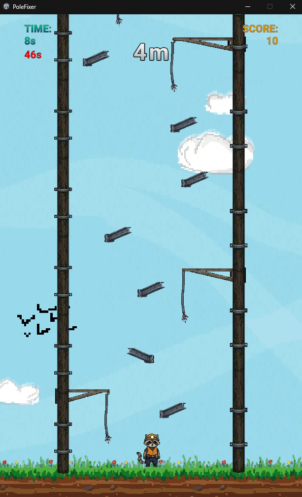

# Pole Fixer🦝

Pole Fixer is a small game where you play as a raccoon engineer repairing high-voltage power poles.

Each time you successfully repair a pole, the next one becomes taller and the time limit gets shorter, making the game progressively more challenging.

## Software

- Unity 6000.3.2f1
- C#
- Visual Studio

## Description

This game was created during my one-month school internship.

It was my first project in Unity and one of my first projects written in C#. During the internship, I was learning C# through a Udemy course while also following free Unity tutorials on YouTube.

Most of the code was written by me. Around 90% of the sprites were generated using AI. Because I was still learning, some of the graphics are not perfectly consistent with the game's pixel grid.

Although the project has a few bugs and could be improved, it was a great learning experience. I learned the basics of Unity, C# scripting, UI, scene management, and game development workflow.

I'm looking forward to creating a much more polished game during my next internship.

## Credits

- Udemy C# course
- Free Unity tutorials on YouTube
- AI-generated sprites used for educational purposes

## 

